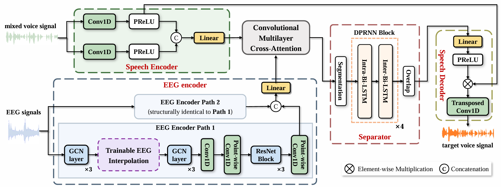
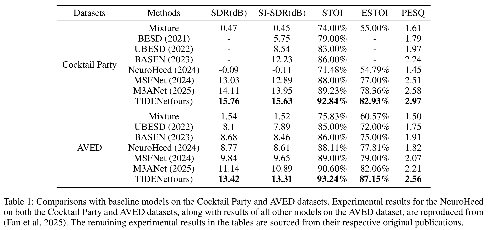
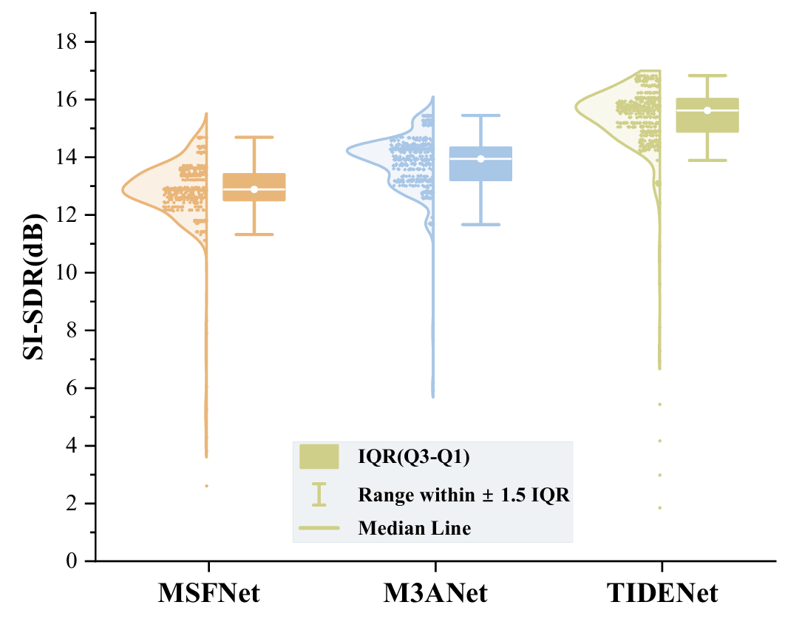

# TIDENet

This is a PyTorch implementation for the AAAI'25 paper "Trainable EEG Interpolation and Structure-Sharing Dual-Path Encoders for Brain-Assisted Target Speaker Extraction"

## Introduction

Brain-assisted target speaker extraction (TSE) isolates a target speaker's voice from a mixture by leveraging task-specific representations in Electroencephalogram (EEG) signals. However, existing methods rely on fixed interpolation for EEG-audio alignment, introducing redundant computations. They also employ single-path encoders that extract only target-relevant features while neglecting complementary, irrelevant ones, limiting discriminability. To address these limitations, this paper proposes a **T**rainable EEG **I**nterpolation and Structure-sharing **D**ual-path **E**ncoders network (TIDENet).The proposed Trainable EEG Interpolation (TEI) uses a neural network module to leverage cross-sample EEG information during resampling by parameters updating, thereby overcoming the limitations of fixed interpolation. The Structure-sharing Dual-path Encoders (SSDPE) extend existing speech and EEG encoders by introducing dual paths that separately process features relevant and irrelevant to the target speaker and incorporates interactive fusion between them, which enhances the encoder's ability to capture task-relevant information. Experimental results on public datasets demonstrate that TIDENet achieves relative improvements of up to **20.47\%**, **22.22\%**, **2.91\%**, **6.20\%**, and **15.84\%** in signal-to-distortion ratio (SDR), scale-invariant SDR (SI-SDR), short-time objective intelligibility (STOI), extended STOI (ESTOI), and perceptual evaluation of speech quality (PESQ), respectively, compared to the state-of-the-art. These significant gains validate the effectiveness of the proposed TEI method and SSDPE architecture.

## The Architecture of TIDENet

<div class="img-center">
    
</div>

## Prerequisites

- **conda**:
  - _libgcc_mutex=0.1=conda_forge
  - _openmp_mutex=4.5=2_gnu
  - bzip2=1.0.8=h7f98852_4
  - ca-certificates=2022.12.7=ha878542_0.conda
  - cudatoolkit=11.2.0=h73cb219_9
  - cudnn=8.1.0.77=h90431f1_0
  - ld_impl_linux-64=2.39=hc81fddc_0
  - libffi=3.4.2=h7f98852_5
  - libgcc-ng=12.2.0=h65d4601_19
  - libgomp=12.2.0=h65d4601_19
  - libnsl=2.0.0=h7f98852_0
  - libsqlite=3.40.0=h753d276_0
  - libstdcxx-ng=12.2.0=h46fd767_19
  - libuuid=2.32.1=h7f98852_1000
  - libzlib=1.2.13=h166bdaf_4
  - ncurses=6.3=h27087fc_1
  - openssl=3.1.0=h0b41bf4_0.conda
  - pip=22.3.1=pyhd8ed1ab_0
  - python=3.8.13=ha86cf86_0_cpython
  - readline=8.1.2=h0f457ee_0
  - setuptools=65.5.1=pyhd8ed1ab_0
  - sqlite=3.40.0=h4ff8645_0
  - tk=8.6.12=h27826a3_0
  - wheel=0.38.4=pyhd8ed1ab_0
  - xz=5.2.6=h166bdaf_0

- **pip**:
  - absl-py==0.15.0
  - appdirs==1.4.4
  - astunparse==1.6.3
  - audioread==3.0.0
  - blessed==1.20.0
  - cachetools==5.2.0
  - certifi==2022.12.7
  - cffi==1.15.1
  - charset-normalizer==3.1.0
  - clang==5.0
  - colorama==0.4.6
  - conda-pack==0.7.1
  - contourpy==1.0.7
  - cycler==0.11.0
  - decorator==5.1.1
  - docopt==0.6.2
  - dotmap==1.3.30
  - einops==0.6.1
  - flatbuffers==1.12
  - fonttools==4.39.3
  - future==1.0.0
  - gast==0.4.0
  - gitdb==4.0.10
  - gitpython==3.1.31
  - google-auth==2.13.0
  - google-auth-oauthlib==0.4.6
  - google-pasta==0.2.0
  - gpustat==1.1
  - grpcio==1.54.0
  - h5py==3.1.0
  - idna==3.4
  - importlib-metadata==5.0.0
  - importlib-resources==5.12.0
  - jinja2==3.1.2
  - joblib==1.2.0
  - jsonpickle==3.0.1
  - keras==2.6.0
  - keras-preprocessing==1.1.2
  - kiwisolver==1.4.4
  - lazy_loader==0.2
  - librosa==0.10.0.post2
  - llvmlite==0.40.0
  - markdown==3.4.1
  - markupsafe==2.1.1
  - matplotlib==3.5.3
  - mir-eval==0.7
  - mne==1.3.1
  - msgpack==1.0.5
  - munch==2.5.0
  - numba==0.57.0
  - numpy==1.22.4
  - nvidia-ml-py==11.525.112
  - nvitop==1.1.2
  - oauthlib==3.2.2
  - opt-einsum==3.3.0
  - packaging==23.1
  - pandas==1.3.5
  - pesq==0.0.4
  - pillow==9.5.0
  - platformdirs==3.5.0
  - pooch==1.6.0
  - protobuf==3.19.6
  - psutil==5.9.5
  - py-cpuinfo==9.0.0
  - pyasn1==0.4.8
  - pyasn1-modules==0.2.8
  - pycparser==2.21
  - pydot==1.4.2
  - pyparsing==3.0.9
  - pypdf2==3.0.1
  - pystoi==0.3.3
  - python-dateutil==2.8.2
  - pytz==2023.3
  - requests==2.28.2
  - requests-oauthlib==1.3.1
  - rsa==4.9
  - sacred==0.8.4
  - scikit-learn==1.2.2
  - scipy==1.7.3
  - six==1.15.0
  - smmap==5.0.0
  - soundfile==0.12.1
  - soxr==0.3.5
  - tensorboard==2.10.1
  - tensorboard-data-server==0.6.1
  - tensorboard-plugin-wit==1.8.1
  - tensorflow-addons==0.15.0
  - tensorflow-estimator==2.12.0
  - tensorflow-gpu==2.6.0
  - termcolor==1.1.0
  - threadpoolctl==3.1.0
  - torch==1.12.0+cu113
  - torch-complex==0.4.3
  - torchaudio==0.12.0+cu113
  - torchsummary==1.5.1
  - torchvision==0.13.0+cu113
  - tqdm==4.65.0
  - typeguard==2.13.3
  - typing_extensions==4.5.0
  - urllib3==1.26.15
  - wcwidth==0.2.6
  - werkzeug==2.2.2
  - wrapt==1.12.1
  - zipp==3.15.0

## Usage

### 1. Download the datasets

- [Cocktail Party](https://datadryad.org/dataset/doi:10.5061/dryad.070jc)

- [AVED](http://iiphci.ahu.edu.cn/toAuditoryAttentionEnglish)

### 2. Model reproduction

#### 2.1 Set the path of processed datasets

In the JSON files ```configs/BASEN.json```, set the ```"root"``` field inside the value for the ```"trainset_config"``` key to the dataset path; this path must precisely point to the directory containing the processed h5 files, for example:

```json
"trainset_config": {
    "root": "/dataset_path/"
}
```
#### 2.2 Specify the GPU device ID

In the ```distributed.py``` file, immediately after the ```import os``` statement, set the ```"CUDA_VISIBLE_DEVICES"``` entry in ```os.environ``` to a comma-separated string of digit IDs. Each digit represents a GPU ID and may be a single ID or multiple IDs; if multiple IDs are provided, the model will run multi-GPU training using PyTorch's distributed framework. For example:

```python
import os
os.environ['CUDA_VISIBLE_DEVICES'] = "0,1"
```

#### 2.3 Train the model from scratch

Create and activate the Python virtual environment specified in environments.yml, run ```distributed.py``` inside that environment:

```bash
python distribution.py
```

and then wait for the model training to finish.

#### 2.4 Select the best checkpoint

After training completes, checkpoint files from the training run are saved in the ```exp/BASEN/checkpoint/``` directory; each filename equals the iteration number when it was saved. Locate the checkpoint file with the largest numeric filename. In ```configs/experiments.json```, append that checkpoint filename (including its file extension) to the end of the string value for the ```"model_path"``` field. Also set the ```"dataset_root"``` field to the value of the ```"root"``` field under the ```"training_set"``` entry in ```configs/BASEN.json```. For example:

```json
"test": {
    "model_path": "exp/BASEN/checkpoint/209000.pkl",
    "dataset_root": "/dataset_path/"
}
```

#### 2.5 Test the model

In test.py, immediately after the ```import os, sys, shutil, json, time``` statements, set the ```"CUDA_VISIBLE_DEVICES"``` entry of ```os.environ``` to a string containing a single natural number that specifies the GPU device ID for model testing. Because ```test.py``` runs the model on a single GPU, the model will run on one card even if ```"CUDA_VISIBLE_DEVICES"``` is set to multiple comma-separated integers. After setting this, run ```test.py```: 

```bash
python test.py
```

and wait for the test to finish.

#### 2.6 View test results

Test results are saved automatically in the ```experiments/``` directory located alongside ```test.py```. In the ```other_outputs subfolder```, open the ```evaluation_sNone_gtest.csv``` file to view the model’s evaluation metrics for each test sample. The structure of ```experiments/``` is as follows:

```
└─experiments
    │
    └─yyyy-mm-dd-hh-mm-ss--xxxx-mc_test_
       ├─images
       ├─other_outputs
       │  ├─...
       │  │
       │  └─evaluation_sNone_gtest.csv
       │  
       ├─1
       ├─text
       └─trained_models
```

### Performance of TIDENet

Our quantitative comparisons:

<div class="img-center">
    
</div>

Our qualitative comparisons:

<div class="img-center">
    
</div>
